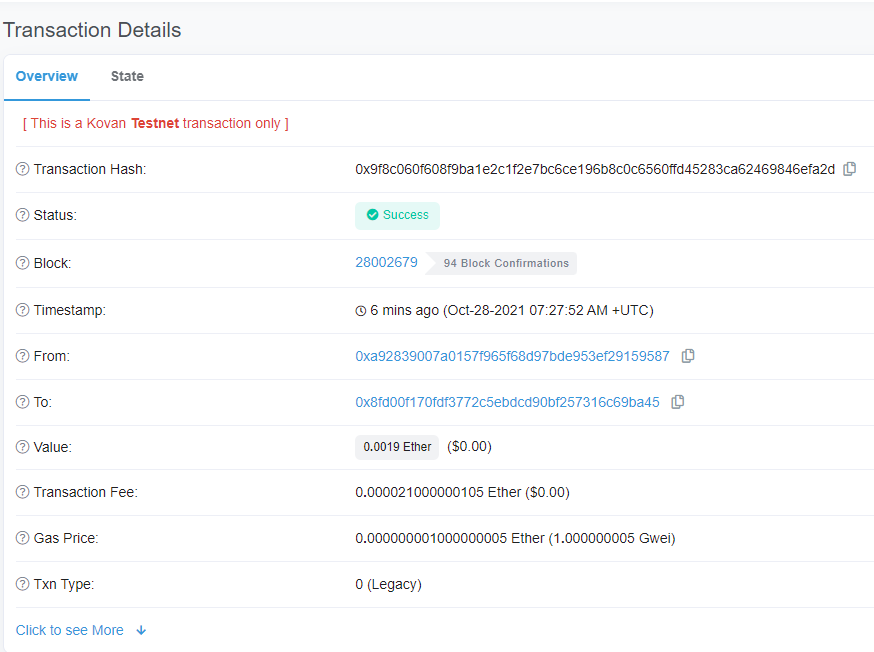
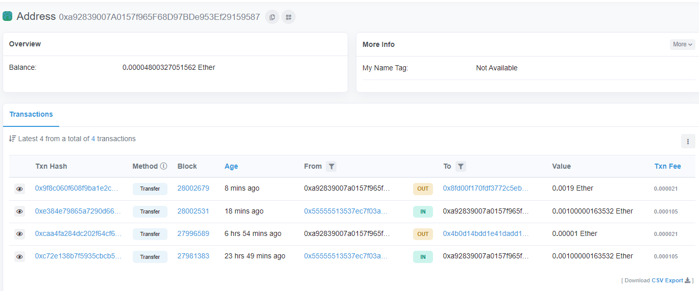
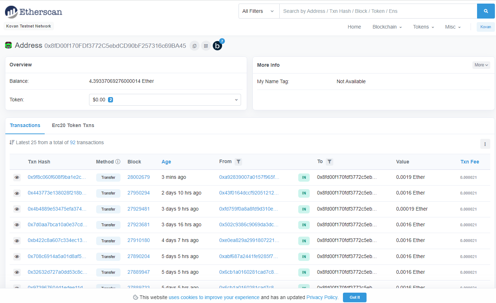
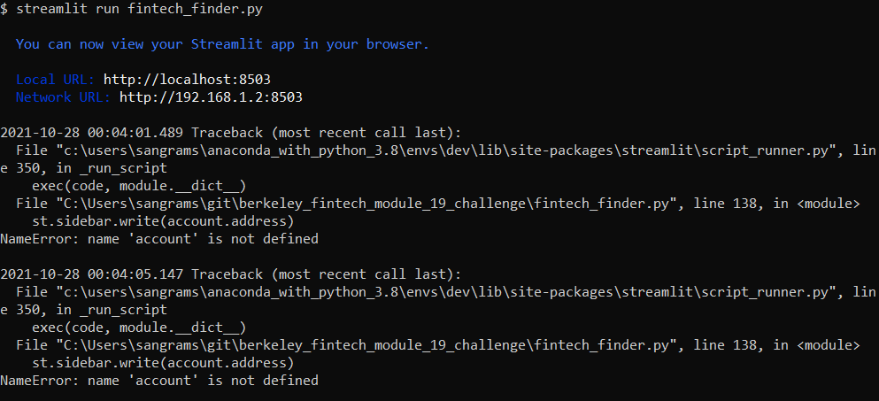

# Berkeley Fintech Module 19 Challenge
Integrate Ethereum Blockchain into python application and run application using Streamlit to pay fintech professionals with cryptocurrency. 

Streamlit application main page


A Sample Transaction using this application - 
Transaction Details from address starting with 0xa92 to address starting with 0x8fd:


Sender Details showing the transaction and balance:


Recipient Details showing the transaction and balance:


---

## Technologies

This project uses python 3.7 along with the following packages:

* [Streamlit](https://streamlit.io/) - Streamlit turns data scripts into shareable web apps.

* [web3](https://pypi.org/project/web3/) - A Python library for interacting with Ethereum.

* [bip44](https://pypi.org/project/bip44/) - Simple Python bip44 implementation. Mnemonic + bip32.

---

## Installation Guide

Please install the following before starting the application

```python
  pip install streamlit
  pip install web3
  pip install bip44

```
In case of issues, please see the requirements.txt for a complete list of packages with versions needed to run this application or install all the required packages using the requirements.txt as shown below:

```python
  pip install -r requirements.txt
```

---

## Usage

Please download the project or clone the project using git clone

Please execute the following on the command line in the project directory:

```python
streamlit run fintech_finder.py
```
streamlit should open automatically in a browser. 
If it does not, please follow the instructions on the command line.

Usage screenshot:


---

## Contributors

Sangram Singh (sangramsinghg@yahoo.com)

---

## License

MIT